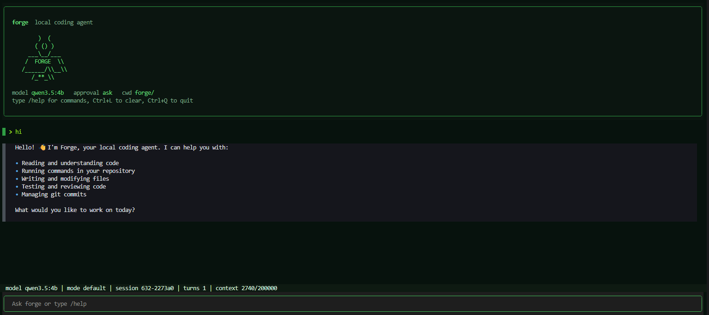

# forge

Local coding agent for real repositories.

Forge is a small but structured coding agent that runs inside a local repo, uses tools instead of guessing, keeps local session evidence, and carries forward useful project memory across sessions.



## Why Forge

Most coding agents look impressive in a demo and become hard to trust in real work. Forge is built around a different goal: make local code work inspectable, resumable, and grounded in the repository itself.

That means:

- tool calls are explicit
- risky actions can be gated by approval and sandbox rules
- prompts are assembled from real workspace context instead of pure chat history
- every run leaves behind evidence you can inspect later
- memory is stored as local files, not hidden in an opaque conversation

## What it does

- Reads, searches, and edits code in a local repository
- Runs shell commands with approval-aware execution
- Supports TUI, REPL, and one-shot task execution
- Persists session history, event streams, traces, reports, and task state
- Supports plan mode, todo tracking, worker agents, and skills
- Maintains working memory and durable project memory
- Works with OpenAI-compatible and Anthropic-compatible providers, including DeepSeek-style profiles

## What makes Forge different

Forge is not just a loop of `prompt -> tool -> prompt`.

It has a small runtime architecture around the model:

- `runtime`: owns session state, memory, evidence, workspace state, and tool registry
- `engine`: runs the turn loop that coordinates model calls, tool execution, retries, and final answers
- `tool runtime`: validates tool calls, enforces policy, and records results
- `context assembly`: builds prompts from rules, workspace facts, memory, and recent history
- `evidence plane`: writes session events, run traces, reports, and checkpoints under `.forge/`
- `memory system`: separates working memory, daily logs, durable topics, and memory index files

This is the main idea behind Forge: the model is only one part of the system. The runtime around it matters just as much.

## How it works

At a high level, one request goes through this path:

1. Forge inspects the workspace and assembles prompt context.
2. The model chooses either a tool call or a final answer.
3. Tool calls are validated and executed through the runtime.
4. Results are written to history and evidence files.
5. Useful facts are promoted into working memory or durable memory.
6. The next turn continues from structured state instead of starting from scratch.

That makes Forge better suited for longer coding tasks than a stateless chat loop.

## Core ideas

### 1. Tools are part of the contract

Forge expects the model to act through explicit tools for:

- file reads
- search
- shell commands
- writing and patching files
- plan mode actions
- todo updates
- worker agents
- user interaction

This keeps execution inspectable and gives the runtime a place to enforce rules.

### 2. Memory is local and file-based

Forge uses layered memory instead of replaying a giant transcript forever:

- working memory for the current session
- daily logs for append-only observations
- durable topic files for long-lived project knowledge
- `MEMORY.md` as a compact memory index

It can also run background `auto-dream` consolidation to turn scattered notes into reusable project memory.

### 3. Evidence is first-class

Each session and run leaves behind structured files such as:

- `.forge/sessions/<id>.json`
- `.forge/sessions/<id>.events.jsonl`
- `.forge/runs/<run_id>/trace.jsonl`
- `.forge/runs/<run_id>/report.json`

This makes it easier to debug agent behavior, understand failures, and resume work later.

### 4. The runtime can evolve

Forge v3 moved beyond a minimal agent loop and introduced a more explicit runtime shape: event bus, evidence pipeline, plan mode, worker management, memory consolidation, and lifecycle hooks.

That makes it a better base for experimenting with coding-agent infrastructure rather than just prompt engineering.

## Interface

Forge can run in several ways on top of the same core runtime:

- Textual TUI
- terminal REPL
- one-shot CLI execution
- resumed sessions from local state

## Install

Requirements:

- Python 3.10+
- a working model provider

Install from source:

```bash
git clone <your-repo-url>
cd forge
pip install -e .
```

Run it:

```bash
forge
```

You can also run it directly from the checkout:

```bash
python -m forge
```

## Quick start

Copy the example project config:

```bash
cp .forge.toml.example .forge.toml
```

Example provider profile:

```toml
provider = "deepseek"

[providers.deepseek]
protocol = "anthropic"
api_key = "sk-..."
base_url = "https://api.deepseek.com/anthropic"
model = "deepseek-v4-pro"
```

Useful entrypoints:

```bash
forge
forge --repl
forge "find the cause of the flaky login 500"
forge --resume latest
forge --cwd /path/to/repo
forge --approval ask
forge --sandbox best_effort
```

## Configuration

Forge resolves config in this order:

```text
CLI args > environment variables > project .forge.toml > global config > built-in defaults
```

Supported provider styles:

- OpenAI-compatible
- Anthropic-compatible
- DeepSeek-style profiles

Useful environment variables:

- `FORGE_PROVIDER`
- `FORGE_API_KEY`
- `FORGE_BASE_URL`
- `FORGE_MODEL`
- `OPENAI_API_KEY`
- `ANTHROPIC_API_KEY`
- `DEEPSEEK_API_KEY`

More detail:

- [Configuration](docs/configuration.md)
- [Sandbox](docs/sandbox.md)

## Typical workflow

Inside Forge you can mix natural language with slash commands:

```text
/help
/skills
/session
/context
/usage
/memory
/remember This repo uses pytest, not unittest.
/dream
/plan Refactor provider loading flow
/agents
/compact
```

## Project structure

```text
forge/
|-- forge/
|   |-- cli.py
|   |-- core/
|   |-- providers/
|   |-- tools/
|   |-- features/
|   `-- tui/
|-- docs/
|-- tests/
|-- assets/
`-- release/
```

Important directories:

- `forge/core/`: runtime, engine, session state, evidence, workers, context
- `forge/providers/`: model provider adapters
- `forge/tools/`: tool registry and tool implementations
- `forge/features/`: memory, skills, sandboxing
- `forge/tui/`: Textual UI
- `tests/`: runtime and acceptance coverage

## Testing

```bash
pip install -e ".[dev]"
pytest tests/ -q
```

## Docs

- [Configuration](docs/configuration.md)
- [Memory](docs/memory.md)
- [Skills](docs/skills.md)
- [Sandbox](docs/sandbox.md)
- [v3 Changelog](release/v3/CHANGELOG.md)

## Status

Forge is the renamed and evolving version of the earlier Pico local coding agent codebase. The branding and documentation are being aligned around `forge`, while the core direction stays the same: local coding, explicit tool use, memory, and evidence.

## License

MIT
